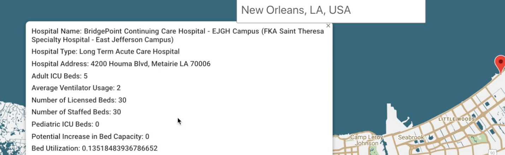

# Covid TrackR
>Covid TrackR is a real-time tracking app that allows you to display the overall COVID-19 information in the U.S, detailed information about the states, and view the hospital information based on the location you type.

[Demo](https://www.youtube.com/watch?v=7Sklsae1jFA&t=10s)
## Table of Contents
1. [Build With](#build-with)
    * [Prerequisites](#prerequisites)
    * [Installation](#installation)
2. [Getting Started](#getting-started)
3. [Usage](#usage)
4. [Contact Info](#contact-info)
## Build With
* [Ruby on Rails](https://rubyonrails.org/)
* [React](https://reactjs.org/)
* [Redux](https://redux.js.org/)
* [Bootstrap](https://getbootstrap.com/)
* [CSS](https://en.wikipedia.org/wiki/Cascading_Style_Sheets)
* [ChartJS](https://www.chartjs.org/)

## Getting Started
### Prerequisites

*Before you begin*

* Ensure you have installed the latest version of **React**.<br>([Environment Setup](https://www.tutorialspoint.com/reactjs/reactjs_environment_setup.htm))

* You have a **Mac** machine.<br>(*instructions about Windows/Linux machines will come soon*)

### Installation
```bash
Clone the repo
```
```bash
cd into the backend folder
```
**In the backend folder, install the packages by running:**
```bash 
bundle install
```
**Then, fire up the backend server:**
```bash 
rails s
```
**Open a new terminal**
```bash
cd into the frontend folder
```
**In the frontend folder, install the NPM packages by running:**
```bash
npm install
```
Then, fire up the frontend server:
```bash
npm start
```

## Usage
To login/sign up, you can either use **Ettie** for the username, and **123** for the password (*this is one of the users that already exists in the database*) or sign up.
## API Reference
**APIs that I have used in this project:**

**[The COVID Tracking App](https://covidtracking.com/data/api#swaggerWrapper)**


**[ESRI](https://coronavirus-resources.esri.com/datasets/definitivehc::definitive-healthcare-usa-hospital-beds/data?geometry=94.394%2C-16.820%2C-119.356%2C72.123&orderBy=HQ_CITY&page=10)** 


## Contact Info
If you want to contact me you can reach me through:

[Email](melike180400@gmail.com)

[LinkedIn](https://www.linkedin.com/in/melike-kilic/)

[Twitter](https://twitter.com/melikeekilic)